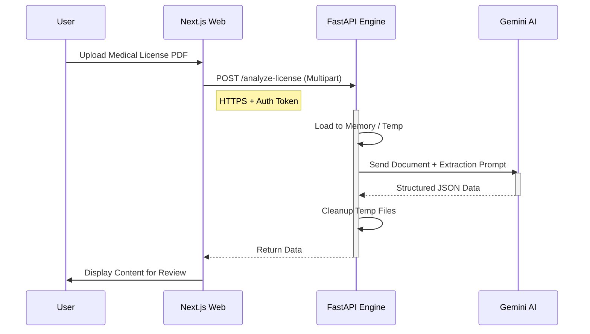

# System Architecture: Privacy by Design AI Engine

## Overview
Synapse Scholar-Flow uses a decoupled architecture for processing sensitive medical license PDFs. The core principle is **Privacy by Design**, ensuring that sensitive PII (Personally Identifiable Information) in documents is processed ephemerally and minimally retained.

## Components

1.  **Client (Next.js)**: 
    - Handles user authentication.
    - Uploads files.
2.  **AI Engine (FastAPI)**: 
    - Stateless service.
    - Consumes files, extracts data, returns structured JSON.
3.  **Gemini 2.5 Flash-Lite**: 
    - LLM Provider for extraction.

## Data Flow (Secure PDF Processing)

1.  **Upload**: Authenticated user uploads PDF from `apps/web`.
2.  **Transmission**: File is sent to `apps/api` (FastAPI) via HTTPS.
    - *Constraint*: File is NOT saved to disk if possible, or saved to a temporary RAM-disk (`/tmp` with restricted lifecycle).
3.  **Extraction (Gemini)**:
    - FastAPI constructs a prompt for Gemini 2.5.
    - The PDF content (as binary or text) is sent to Gemini API.
    - **Privacy Guardrail**: We use Gemini's stateless API params (if available) or ensure data is not used for model training (Enterprise settings).
4.  **Response**:
    - Gemini returns structured JSON (e.g., Patient Name, Diagnosis, Days Off).
    - FastAPI sanitizes the response (redacts unnecessary PII if configured).
    - JSON is returned to the Client.
5.  **Persistence**:
    - The *structured data* (dates, basics) is saved to Supabase `medical_licenses` table (future scope).
    - The *original PDF* is **DISCARDED** immediately after processing. It is NEVER stored in an S3 bucket or database permanently.

## Security Controls

- **Ephemeral Processing**: No long-term storage of raw PDFs.
- **RLS**: API requests must carry User Auth Token to validate Organization ID before processing.
- **Sanitization**: AI prompt instructs to ignore fields not required for the business logic.

## Diagram

