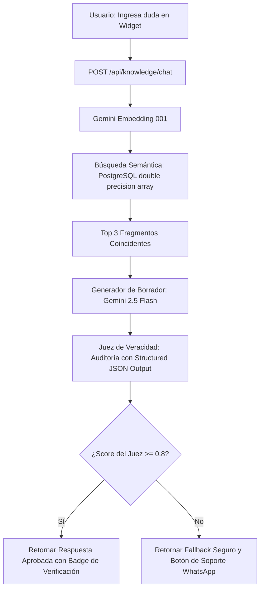

# Scholar-Flow: Documentación Técnica de Funcionalidades Clave

Esta documentación detalla los aspectos técnicos, de base de datos, flujos de datos e integraciones de las funcionalidades implementadas en la plataforma SaaS **Scholar-Flow**.

---

## Índice
1. [Suscripción Demo Gratuita y Modelo de Facturación](#1-suscripción-demo-gratuita-y-modelo-de-facturación)
2. [Semilla de Datos de Demostración (Seeding)](#2-semilla-de-datos-de-demostración-seeding)
3. [Gestión Inteligente de Licencias Médicas con IA](#3-gestión-inteligente-de-licencias-médicas-con-ia)
4. [Navegación Fluida a Fichas de Docentes](#4-navegación-fluida-a-fichas-de-docentes)
5. [Módulo Interactivo: Guía de Uso](#5-módulo-interactivo-guía-de-uso)

---

## 1. Suscripción Demo Gratuita y Modelo de Facturación

### Propósito
La plataforma requiere un mecanismo para que los clientes potenciales exploren las características de Scholar-Flow sin barreras de pago, manteniendo el acceso de por vida para la cuenta de demostración institucional oficial.

### Detalles de Implementación
*   **Identificador de Organización Demo**: El sistema reserva el UUID fijo `'00000000-0000-0000-0000-000000000000'` para la institución de pruebas.
*   **Columna de Base de Datos**: La tabla `organizations` incluye la columna `is_demo BOOLEAN DEFAULT FALSE`.
*   **Exención de Bloqueo de Facturación**: 
    - En el backend (`apps/api/main.py`), los decoradores o validaciones de suscripción activa verifican si `is_demo` es `true`.
    - Si la organización tiene activa la bandera de demo, se omite el bloqueo de pasarela de pago (Flow/MercadoPago), permitiendo acceso perpetuo al optimizador de horarios y recomendador por IA.

---

## 2. Semilla de Datos de Demostración (Seeding)

### Propósito
Proporcionar un entorno de simulación realista e interactivo con datos escolares preestablecidos al reiniciar el servidor o inicializar bases de datos de desarrollo.

### Estructura del Script (`apps/api/seed_demo_data.py`)
El script limpia la base de datos en orden inverso de dependencia y luego inserta:
1.  **Organización y Usuario**: Crea la organización con UUID demo y un usuario administrador (`admin@demo.scholarflow.app`, clave hash `1234`).
2.  **Nómina de Profesores (10 Docentes)**: Registra datos realistas de contacto (`email`, `phone`), RUTs válidos, tipo de contrato (Planta, Reemplazo, Honorarios), cantidad de horas contratadas e inicializadas en 0 asignadas.
3.  **Cursos y Asignaturas**: Configura la malla desde 1° Medio hasta 4° Medio con sus respectivas asignaturas de especialidad.
4.  **Licencias Médicas Activas**: Inserta licencias históricas y activas con diagnósticos realistas de ejemplo (CIE-10).
5.  **Bloques Horarios (Schedule Slots)**: Asigna bloques horarios para simular topes de calendario y carga laboral real.

---

## 3. Gestión Inteligente de Licencias Médicas con IA

### Propósito
Optimizar el tiempo de los administradores mediante la lectura automática de licencias médicas físicas (PDF/Imágenes) y la recomendación algorítmica de suplentes calificados.

### Flujo de Datos Técnico

- **Subida de Archivos**: Al subir una licencia, se almacena de forma persistente en el backend (`apps/api/uploads/`) con un nombre único y se registra en `file_path`.
- **Extracción Inteligente**: Gemini 2.5 Flash-Lite extrae información clave estructurada en JSON.
- **Visualización de Original**: El frontend carga el documento guardado mediante enlaces dinámicos en la tabla de historial y en el optimizador de reemplazos lateral.

### Motor de Recomendación de Suplentes
El algoritmo de recomendación prioriza a los docentes bajo las siguientes reglas:
1.  **Especialidad**: Coincidencia directa de la asignatura requerida con la nómina de asignaturas del profesor.
2.  **Disponibilidad Horaria**: El profesor debe tener marcada la casilla de disponibilidad para reemplazos.
3.  **Capacidad de Carga**: Compara las horas asignadas actuales contra su límite de contrato, ordenando de forma ascendente para equilibrar la carga laboral del establecimiento.

---

## 4. Navegación Fluida a Fichas de Docentes

### Propósito
Garantizar una experiencia de usuario integrada al conectar el panel de licencias médicas directamente con el expediente individual de cada profesor sin necesidad de búsquedas manuales.

### Mecanismo de Redirección
1.  **Hipervínculo**: En el listado de licencias médicas, el nombre de los docentes es un enlace Next.js:
    ```tsx
    <Link href={`/dashboard/profesores?view=${encodeURIComponent(professorName)}`}>
    ```
2.  **Parámetro URL**: La página `/dashboard/profesores` utiliza el hook `useSearchParams` de Next.js.
3.  **Apertura Automática**: Si el parámetro `view` está presente al cargar la página, se busca al profesor en el listado y se asigna inmediatamente al estado `viewingProf`, disparando de forma reactiva la modal de detalles con su carga horaria y datos de contacto.

---

## 5. Módulo Interactivo: Guía de Uso

### Propósito
Ofrecer un centro de aprendizaje interactivo dentro de la aplicación para que los usuarios finales y clientes de prueba dominen el uso del recomendador por IA y el planificador de clases.

### Componentes de la Interfaz (`/dashboard/tutorial`)
*   **Encabezado Hero**: Diseñado con un fondo oscuro de alta fidelidad, gradientes de marca y un patrón de cuadrícula escolar.
*   **Pestañas Navegables**:
    - **Conceptos Generales**: Vista de tarjetas generales de los módulos.
    - **Gestión de Licencias e IA**: Flujo numérico interactivo (1 al 4) que ilustra el ciclo de vida de una licencia médica y el procesamiento inteligente.
    - **Planificación de Horarios**: Guía técnica de distribución de bloques.
*   **Sección de Preguntas Frecuentes (FAQs)**:
    - Acordeón interactivo de preguntas administrativas comunes.
    - Respuestas detalladas sobre el funcionamiento del recomendador algorítmico y políticas de carga horaria.

---

## 6. Asistente Técnico y Chatbot Inteligente de Soporte (RAG + Juez)

### Propósito
Proporcionar asistencia técnica interactiva contextualizada a los administradores dentro del panel de Scholar-Flow, con total veracidad en las respuestas basadas únicamente en los manuales de la organización para evitar alucinaciones.

### Componentes Técnicos y Flujos de Datos



### 1. Ingesta y Base Vectorial (`apps/api/seed_knowledge.py`)
*   **Manual Corporativo**: El manual se encuentra en `apps/api/data/knowledge_scholarflow.txt`, cubriendo administración, licencias, recomendación y la exención demo.
*   **Ventana Deslizante**: El script Python segmenta el manual en fragmentos (chunks) de 500 caracteres con un traslape de 100 caracteres.
*   **Vectorización**: Utiliza el modelo `models/gemini-embedding-001` configurado a una dimensionalidad exacta de 768 float values.
*   **Almacenamiento**: Los vectores se guardan en la columna `embedding DOUBLE PRECISION[]` en la tabla `knowledge_base_chunks` en PostgreSQL.

### 2. Pipeline RAG y Gating de Alucinaciones (`apps/api/main.py`)
*   **Búsqueda Semántica**: Calcula la similitud coseno pura en Python entre el vector de consulta y los fragmentos de la base de datos:
    $$\text{similitud} = \frac{u \cdot v}{\|u\| \|v\|}$$
*   **Generador RAG (Draft Node)**: Con un modelo `gemini-2.5-flash` y `temperature: 0.0`, redacta la respuesta basándose estrictamente en el contexto recuperado.
*   **Juez de Veracidad (Judge Node)**: Utiliza Gemini con salida JSON estructurada (`response_schema`) para calificar la fidelidad de la respuesta de `0.0` a `1.0`.
*   **Control de Calidad**: Si el score del juez es menor a `0.8`, la respuesta se intercepta para evitar alucinaciones, entregando un mensaje seguro y sugiriendo contactar a soporte por WhatsApp.

### 3. Interfaz de Usuario (`apps/web/components/dashboard/ChatbotWidget.tsx`)
*   **Floating Widget**: Ubicado de forma fija en la esquina inferior derecha con un botón animado de pulso.
*   **Historial de Mensajería**: Muestra el chat en tiempo real.
*   **Soporte Humano Integrado**: Si la IA no conoce la respuesta verídica, habilita un botón directo para abrir chat de soporte oficial en WhatsApp (+56940413646).
*   **Medalla de Verificación**: Las respuestas correctas muestran un badge indicando que fueron validadas y el porcentaje de fidelidad devuelto por el Juez de Veracidad.

